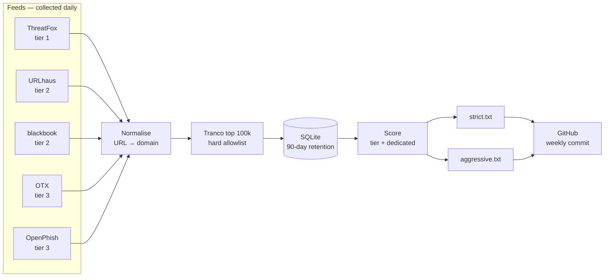

# 🛑 n8n Threat Blocklist
 
> Two DNS blocklists built from five public threat intelligence feeds, deduplicated, scored by source reliability, filtered against the Tranco top domains, and republished weekly. Generated automatically by [n8n](https://n8n.io).
 


 
---
 
## Subscribe
 
**Strict** — malware-dedicated infrastructure only. Conservative, low false-positive risk. Recommended if you're going to add it and never think about it again.
 
```
https://raw.githubusercontent.com/Yel1oww/n8n-threat-blocklist/main/lists/strict.txt
```
 
**Aggressive** — everything collected. Much wider coverage, real false-positive risk. Use this if you can allowlist a domain quickly when something breaks.
 
```
https://raw.githubusercontent.com/Yel1oww/n8n-threat-blocklist/main/lists/aggressive.txt
```
 
Plain domain format, one per line, `#` comments. Works with Pi-hole, AdGuard Home, Blocky, pfBlockerNG, unbound, or anything that accepts a domain list.
 
<details>
<summary><b>Pi-hole setup</b></summary>
Settings → Adlists → paste the raw URL above → Add. Then:
 
```bash
pihole -g
```
 
This only ever *adds* blocking. Pi-hole blocks the union of all your adlists, so nothing here can unblock ads or trackers your other lists already catch.
</details>
Current counts are always in [`lists/stats.json`](lists/stats.json).
 
---
 
## Which list should I use?
 
The difference is one question: **was this domain built to be malicious, or is it a legitimate site that got hacked?**
 
| | strict.txt | aggressive.txt |
|---|---|---|
| Purpose-built malware infrastructure | ✅ | ✅ |
| Compromised legitimate sites | ❌ | ✅ |
| Phishing pages on hacked hosts | ❌ | ✅ |
| Historical / previously-malicious domains | ❌ | ✅ |
| False-positive risk | Low | Moderate |
 
A compromised WordPress site really is serving malware today. Next week the owner patches it and it's an ordinary bakery again. Blocking it protects you now; blocking it permanently in a public list quietly breaks someone's business.
 
Purpose-registered infrastructure has no such lifecycle. It was born bad and stays bad. That's what `strict.txt` contains.
 
---
 
## How it's built
 

 
### Sources
 
| Source | Tier | What it contributes |
|---|---|---|
| [ThreatFox](https://threatfox.abuse.ch) | 1 | Live C2 infrastructure, confidence ≥ 75 only |
| [URLhaus](https://urlhaus.abuse.ch) | 2 | Malware distribution URLs, Spamhaus DBL cross-referenced |
| [blackbook](https://github.com/stamparm/blackbook) | 2 | Historical malware-associated domains |
| [OTX](https://otx.alienvault.com) | 3 | Community-submitted indicators |
| [OpenPhish](https://openphish.com) | 3 | Phishing URLs (community feed) |
 
### Scoring
 
- **strict** — `dedicated AND (tier 1 OR ≥2 independent sources)`
- **aggressive** — everything that survives the allowlists
`dedicated` means the domain looks purpose-registered rather than compromised. It comes from Spamhaus DBL classification where URLhaus provides it, ThreatFox's `botnet_cc` threat type, and URL path-depth as a fallback heuristic.
 
### Guardrails
 
Three independent allowlists, applied at collection **and** again at generation:
 
**1. Infrastructure — hardcoded, always on.** The domains this tool needs to
function: GitHub raw (where the lists are served), every feed API, and Tranco.
Feeds legitimately report some of these, because malware really is hosted on
public code and file hosts. Publishing them would be self-defeating — see the
findings below.
 
**2. Tranco top 100,000 — popularity.** Nothing popular is published, whatever a
feed claims. Matching walks parent domains, so `raw.githubusercontent.com` is
covered by Tranco's entry for `githubusercontent.com`.
 
**3. Manual — human decisions.** Confirmed false positives, permanent, immune to
relisting.
 
Parent matching has one important exception. Suffixes where **each subdomain
belongs to a different party** — `duckdns.org`, `s3.amazonaws.com`,
`workers.dev`, `ngrok.io`, `github.io` — never vouch for their children. Tranco
ranking those platforms says the *platform* is popular; it says nothing about
whether `1hvnc.duckdns.org` is malicious. Without that exception, allowlisting
`duckdns.org` would silently delete the highest-confidence entries in the strict
list, since free dynamic DNS is the classic home of malware C2.
 
Also:
 
- **Snapshot feeds are mirrored, incremental feeds age out.** blackbook and
  OpenPhish return their complete list each fetch, so anything they remove is
  removed here too. ThreatFox, URLhaus and OTX return moving windows, so their
  indicators accumulate and expire after 90 days without re-observation. A
  snapshot response returning less than half of what's already held is treated
  as truncated and won't trigger a prune.
- **IP addresses are discarded.** This is a DNS blocklist.
## Findings worth sharing
 
**Feed overlap is effectively zero.** Of 24,003 collected domains, exactly **2** appeared in more than one source — 0.008%. If this project had been built on the intuitive rule "require two sources to agree," the published list would contain two domains. The feeds don't validate each other; they partition the problem. ThreatFox tracks live C2, blackbook is historical, OpenPhish is phishing, OTX is community reports. Source quality is the only usable signal.
 
**The Tranco allowlist was originally too permissive.** Using the full top 1M as "never block" was shielding active malware — domains like `gitak.top` and `linkerfunyfile.store` rank in the lower hundreds of thousands purely because they receive traffic. Cutting the allowlist to the top 100k fixed it while still protecting genuine false positives like `pinterest.com` and `t.me`.
 
**A blocklist can block its own distribution.** After the first publication,
collection started failing with TLS certificate errors on two feeds. The cause
wasn't a certificate problem at all: `aggressive.txt` contained
`raw.githubusercontent.com` — reported in good faith, since malware is genuinely
hosted there — and the Pi-hole subscribed to that list *from* raw.githubusercontent.com.
Gravity updated, the domain resolved to `0.0.0.0`, and the next fetch got the
resolver's own self-signed certificate.
 
Every subscriber inherits this failure mode, and it fails silently: the list
simply stops updating and nothing announces it. The fix is the hardcoded
infrastructure allowlist above, which holds even when the Tranco cache is empty.
 
**Exact-match allowlisting isn't enough.** The same incident exposed a broader
flaw. Tranco lists registrable domains (`githubusercontent.com`) while feeds
report the hostnames malware actually uses (`raw.githubusercontent.com`).
Comparing exact strings leaves every popular service with a user-content
subdomain unprotected — CDNs, code hosts, storage buckets. Matching has to walk
parent domains, with the shared-suffix exception described above.
 
**"Curated" doesn't mean "dedicated."** blackbook is described as excluding compromised sites, but its list includes plenty of ordinary small businesses — an architecture firm, a Lithuanian studio, a French training provider. That's why it feeds `aggressive` rather than `strict`.
 
---
 
## Known limitations
 
**Aggressive is still growing.** Incremental feeds accumulate for 90 days before reaching steady state, so expect the list to keep climbing for the next few months before it plateaus.
 
**Weekly cadence is a deliberate trade-off.** Phishing domains often live 24–72 hours, so by publication many are already dead. This list is better understood as durable malicious infrastructure than as a fast phishing feed.
 
---
 
## False positives
 
Open an issue with the domain and why you believe it's wrong. Confirmed false positives are added to a permanent manual allowlist, so they won't reappear even if a feed relists them.
 
If a domain in `aggressive.txt` is breaking something for you, allowlist it locally first — that fixes it immediately — then open the issue.
 
---
 
## Maintenance
 
**These lists are maintained by [@Yel1oww](https://github.com/Yel1oww).** Collection runs daily and publication runs every Sunday, both automated. False-positive reports and allowlist decisions are reviewed manually.
 
If a commit hasn't landed in over two weeks, assume something has broken and don't rely on the list being current.
 
---
 
## Run it yourself
 
The workflow files in this repo are exportable and contain no credentials — every secret is a `REPLACE_*` placeholder.
```
├── 04-ti-collect.json     # daily: fetch feeds → SQLite → InfluxDB metrics
├── 05-ti-publish.json     # weekly: score → generate → commit to GitHub
├── ti-aggregate.py        # feed ingestion, scoring, list generation
├── n8n-ti.env             # where your auth keys should live
├── SETUP-threat-intel.md  # how to run this yourself
└── lists/                 # generated output
```

Requirements: self-hosted n8n, Python 3, and free API keys from [auth.abuse.ch](https://auth.abuse.ch) and [otx.alienvault.com](https://otx.alienvault.com). InfluxDB is optional and only used for metrics.
 
Placeholders to fill after importing:
 
| Placeholder | Where |
|---|---|
| `REPLACE_OWNER` / `REPLACE_REPO` | `05` → both GitHub nodes |
| `REPLACE_GITHUB_PAT` | `05` → both GitHub nodes, as `Bearer <token>` |
| `REPLACE_ORG_ID` / `REPLACE_INFLUX_TOKEN` | `04` and `05` → InfluxDB nodes |
 
API keys live in `/etc/n8n-ti.env` on the host, never inside a workflow.
 
Full setup: [SETUP.md](SETUP.md).
 
---
 
## Credits
 
Built on the work of [abuse.ch](https://abuse.ch) (ThreatFox, URLhaus), [stamparm/blackbook](https://github.com/stamparm/blackbook), [LevelBlue OTX](https://otx.alienvault.com), [OpenPhish](https://openphish.com), and [Tranco](https://tranco-list.eu).
 
These feeds are free under fair-use terms. If you're using them commercially, check their licensing.
 
## License
 
Code is MIT. The lists are derived from third-party feeds and are provided as-is, with no warranty — verify before deploying anywhere that matters.
